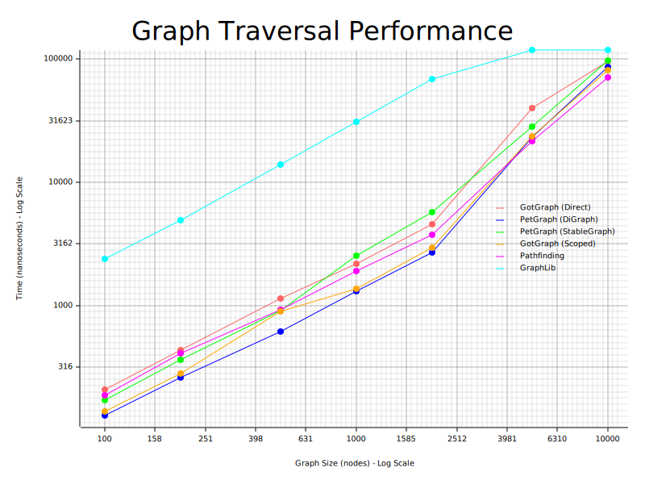
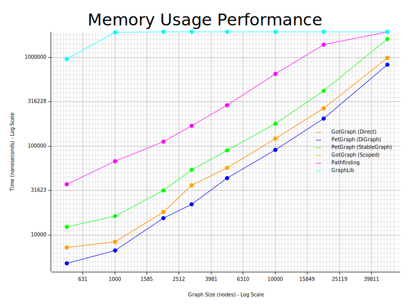

# GotGraph - A type-safe, scope-aware graph library [![Latest Version]][crates.io] [![Documentation]][docs.rs] [![GitHub Actions]][actions]

[Latest Version]: https://img.shields.io/crates/v/gotgraph.svg
[crates.io]: https://crates.io/crates/gotgraph
[Documentation]: https://img.shields.io/docsrs/gotgraph
[docs.rs]: https://docs.rs/gotgraph/latest/
[GitHub Actions]: https://github.com/yasuo-ozu/gotgraph/actions/workflows/rust.yml/badge.svg
[actions]: https://github.com/yasuo-ozu/gotgraph/actions/workflows/rust.yml

GotGraph provides a unique approach to graph manipulation in Rust that leverages
the type system and lifetime checking to prevent common graph-related bugs at
compile time.

## Key Features

- **Lifetime Safety**: Node and edge references cannot escape their intended scope
- **Type Safety**: Strong typing prevents mixing indices from different graphs
- **Zero-Cost Abstractions**: Safety features have no runtime overhead
- **Flexible Graph Types**: Support for different graph implementations
- **Algorithm Support**: Built-in graph algorithms with safe APIs

## Quick Start

### Direct Operations (runtime index check)

You can perform basic graph operations directly without scopes:

```rust
use gotgraph::prelude::*;

let mut graph: VecGraph<&str, i32> = VecGraph::default();

// Add nodes directly
let alice_idx = graph.add_node("Alice");
let bob_idx = graph.add_node("Bob");
let charlie_idx = graph.add_node("Charlie");

// Add edges directly
let edge1 = graph.add_edge(10, alice_idx, bob_idx);
let edge2 = graph.add_edge(20, bob_idx, charlie_idx);

// Query graph information
println!("Graph has {} nodes and {} edges", graph.len_nodes(), graph.len_edges());

// Access data using indices
println!("Node data: {}", graph.node(alice_idx));
println!("Edge weight: {}", graph.edge(edge1));

// Iterate over all data
for node_data in graph.nodes() {
    println!("Node: {}", node_data);
}

// Use algorithms directly
let components: Vec<_> = gotgraph::algo::tarjan(&graph).collect();
println!("Found {} strongly connected components", components.len());
```

### Using `scope()` (compile-time index check)

```rust
use gotgraph::prelude::*;

let mut graph: VecGraph<i32, &str> = VecGraph::default();

// Add nodes and edges in a scoped context
graph.scope_mut(|mut ctx| {
    let n1 = ctx.add_node(42);
    let n2 = ctx.add_node(100);
    ctx.add_edge("connects", n1, n2);
    
    // Access data within the same scope
    println!("Node 1: {}", ctx.node(n1));
    println!("Node 2: {}", ctx.node(n2));
});
```

## Core Concepts

### Scoped Operations

We provide `scope()` and `scope_mut()` to create a scope, which determines the
lifetime of all `NodeIx` and `EdgeIx`. It ensures that all existing `NodeIx` or
`EdgeIx` are pointing valid nodes or edges, without any runtime check.

This prevent some use-after-free bugs, which frequently occures in practical
graph operation.

### Type-Safe Indices

Node and edge indices are strongly typed and cannot be mixed between different graphs
or scopes, preventing common indexing errors.

### Zero-Cost Safety

The safety features are enforced at compile time and have no runtime overhead. The
generated code is as efficient as unsafe alternatives.

## Performance Comparison

GotGraph provides competitive performance compared to other graph libraries.

- GotGraph(direct) : use gotgraph with runtime check
- GotGraph(scoped) : use gotgraph with compile-time check (safe)
- petgraph(DiGraph) : use unsafe operation of petgraph
- petgraph(Scoped) : use safe operation of petgraph


### Graph Creation Performance


### Graph Traversal Performance  


### Memory Usage Performance


The benchmarks demonstrate that GotGraph's scoped operations provide competitive performance while maintaining compile-time safety guarantees. In traversal operations, GotGraph shows particularly strong performance characteristics.

## Usage Examples

### Creating and Manipulating Graphs

```rust
use gotgraph::prelude::*;

let mut graph: VecGraph<&str, i32> = VecGraph::default();

graph.scope_mut(|mut ctx| {
    let alice = ctx.add_node("Alice");
    let bob = ctx.add_node("Bob");
    let charlie = ctx.add_node("Charlie");
    
    // Add weighted edges
    ctx.add_edge(10, alice, bob);
    ctx.add_edge(20, bob, charlie);
    ctx.add_edge(5, alice, charlie);
    
    // Query the graph
    println!("Graph has {} nodes and {} edges", 
             ctx.len_nodes(), ctx.len_edges());
    
    // Iterate over outgoing edges
    for edge_tag in ctx.outgoing_edge_indices(alice) {
        let weight = ctx.edge(edge_tag);
        let [from, to] = ctx.endpoints(edge_tag);
        println!("Edge from {} to {} with weight {}", 
                 ctx.node(from), ctx.node(to), weight);
    }
});
```

### Using Graph Algorithms

```rust
use gotgraph::algo::tarjan;
use gotgraph::prelude::*;

let mut graph: VecGraph<&str, ()> = VecGraph::default();

// Build a graph with cycles
graph.scope_mut(|mut ctx| {
    let a = ctx.add_node("A");
    let b = ctx.add_node("B");
    let c = ctx.add_node("C");
    
    ctx.add_edge((), a, b);
    ctx.add_edge((), b, c);
    ctx.add_edge((), c, a); // Creates a cycle
});

// Find strongly connected components
let components: Vec<_> = tarjan(&graph).collect();
println!("Found {} strongly connected components", components.len());
```